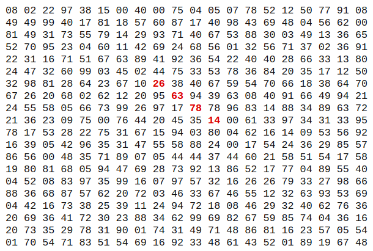

# php-bidirectional-array-exercise

En un tablero de 20 x 20, ¿Cuál es el mayor número que puede conseguirse al multiplicar 4 números adyacentes en una misma dirección? (Arriba, abajo, izquierda, derecha o diagonalmente)

